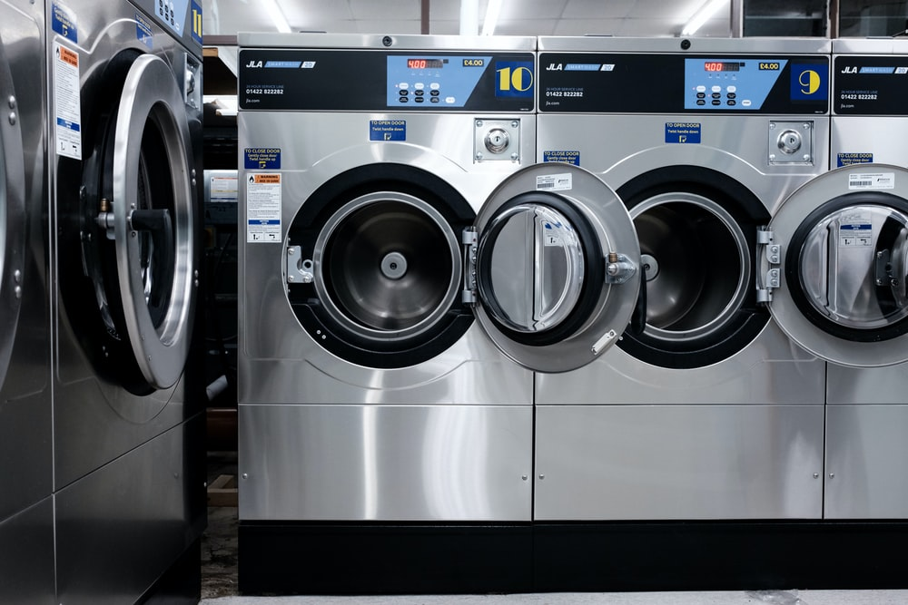

# Laundry App

> Side project using a free API 

### An App For Order And Track Laundry List

What is the best app ? View the list apps from [Mushlihun](https://mushlihun.github.io/) and search for the best apps. 

### Design

## `Tech Specs`

- API
- React
- React Hooks
- CSS
- CSS module
- Git Workflow
- npm
- ionic

## `Project setup`

1. Clone this repository.
2. Install all npm dependencies

   `npm install`

3. To run the app in development mode npm start, then open http://localhost:4200 to view it in the browser

